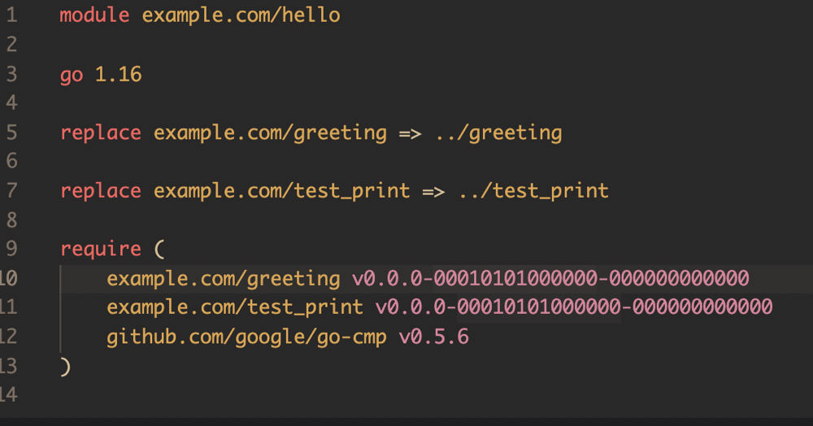

# 理解GO模块

> GO中的导入和Python的导入类似

## 如何组织程序

* 一般以一个文件夹内所提供的内容称为一个module，被定义为详细的获取路径，一般是下载地址（xxx.com or xxx.git等）+ 具体的文件夹地址（[具体go如何获取模块](https://golang.google.cn/ref/mod#vcs-find)）

* 该文件夹下一般会定义一个go.mod，其中就包含了这个模块的完整路径。除此之外，还提供了该模块的依赖模块信息（如何获取，以及相应的版本号，go的版本。）

  `go mod init`可以自动生成这个go.mod文件

  

* 一般一个module包含一个package(每个go源文件都要指定属于哪个package），但可以有多个源文件（即他们同属于一个package就行）

* 同个package源程序可以直接引用对应的函数和全局变量（这个不需要导出），但是如果需要提供给其他package使用，则需要通过首字母大写来强制导出，这是go语言直接规定的。不过需要注意的是，进行库或可执行程序构建的时候，需要包含该package的所有源文件，或者有未定义的问题，和GCC中的链接里的符号概念相似。

* go可执行程序的入口强制在一个main的package里的main函数，`go install`或`go build`都是构建成二进制可执行程序，前者构建到了`$GOBIN`路径下，后者在当前路径下

## 关于导入其他模块

基本使用
```go
import (
    'fmt'
    'example.com/hello'
    'github.com/google/go-cmp/cmp'
)
```
* 导入的时候指定module所在文件夹路径即可，不需要具体文件
* 导入本module下的其他module，不需要下载
* 导入本地文件系统的其他module，需要通过 `go mod edit -rplace=xxxx=xxxx` 替换module地址，然后通过go mod tidy 加载这个库（见后面）
* 相对路径导入module，标准库或其他 需要存在GOPATH路径下，一般在/usr/local/go/src/（mac os) 
* 导入远程库，需要通过`go mod tidy`加载这个库（该命令实现了，自动查找依赖以及，以及自动下载。 **具体做的事情不清楚，即将库下载到了哪里？又是如何指明下载位置的路径的？**）

模块的使用和python类似，都是包名加上对应的方法或变量

## VScode配置GO环境

* 安装go插件
* go插件需要安装一些tools 不过vscode自带的安装会提示失败（有说墙的原因，不过开了VPN还是没有用） 目前解决方法 采用了[这个](https://stackoverflow.com/questions/43018667/vs-code-cant-install-the-go-tools)，直接在终端里面安装对应的go-tools就行
* 使用时，需要将module作为顶层路径打开（即根目录下有go.mod)，这样打开定义，智能提示就能正常

## 一些值得注意的点

* init函数的使用，该函数会在全局变量初始化后自动执行
* Slic的使用，[文档](https://blog.golang.org/slices-intro)
* Maps的使用，[文档](https://blog.golang.org/maps)
* range的使用，类似CPP的范围迭代器
* _ 下划线表示匿名变量 [文档](https://golang.google.cn/doc/effective_go#blank)
* 单元测试，命名，函数接收参数

